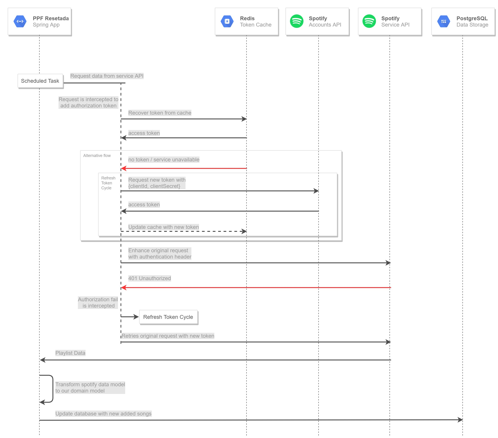

# PPF Resetada

Once a week, me and a group of friends update a collaborative playlist on Spotify, sharing with each other whatever 3 songs are on our minds in the moment. In the beginning of the week one of us clears the playlist so we all can start adding the songs for the following days.

The problem is, once the previous week's songs are erased we lose the track of every awesome addition we made. Have we repeated a song this year yet? What artists do we love most? Is it really 90% metal, 9% nostalgia and 1% the Space Jam main theme I add every once in a while? Could we generate a random "Top 100" by the end of the year? 

To answer all those questions, I decided to build our own history log...


## How it works

1. Everyday, the service automatically requests our playlist using the [Spotify API](https://developer.spotify.com/documentation/web-api/)
2. Every new song found added is added to a database, so we don't ever lose it
3. Anytime we want, we can check our track history requesting our own API.

*A diagram to make it look professional*




## Requirements

- PostgreSQL
  - To store playlist, songs and users data
  - Database migration is automatically supplied by Flyway during the application startup
- Redis (not mandatory, but recommended)
  - To cache refreshable API tokens
  
## Usage

### Docker Image

```bash
# Clone this repository to your machine
$> git clone https://github...

# Run a clean project build
$>./gradlew clean build

# Build the docker image
$> docker build -t "ppf-resetada" .

# Setup the environment parameters using your favorite text editor
$> vim env.properties

# Start the application 
$> docker run --env-file env.properties ppf-resetada
``` 

If all went well, the web api is up and the service already made it's first request to Spotify. If there's any song in your playlist, it should also be in the database by the time.
```
# Check the api in the console or in your browser
$> curl localhost:8080/ppf/history
``` 

#### Environment Parameters
| Parameter                 | Description                                                                       | Default Value         | 
|---------------------------|-----------------------------------------------------------------------------------|-----------------------|
|spring.datasource.url      | Postgresql URL in the format `jdbc:postgresql://host:port/mydb`                   |                       |              
|spring.datasource.username | Postgresql database username                                                      |                       |
|spring.datasource.password | Postgresql database password                                                      |                       |
|spring.redis.host          | Redis URL (i.e. `localhost`, `192.168.0.123`)                                     |                       |             
|spring.redis.port          | Redis Port                                                                        | `6379`                |             
|spotify.clientId           | Your Spotify App Client ID                                                        |                       |              
|spotify.clientSecret       | Your Spotify App Client Secret                                                    |                       |              
|spotify.playlistId         | The ID of the spotify playlist you want to track (i.e. `5b9DdxGlbaHaBovSNAgVbu`)  |                       |
|spotify.historyUpdate      | Time interval (in milliseconds) between each update                               | `21600000` (6 hours)  |

## Next Steps

- Link user ids to a relatable name (requires it's own request and table to update public user data)
- Provide more interesting APIs and filtering
- Build a frontend app
- Provision AWS infrastructure for the app using Terraform  
- Have our own spotify year recap
- Manage multiple playlists